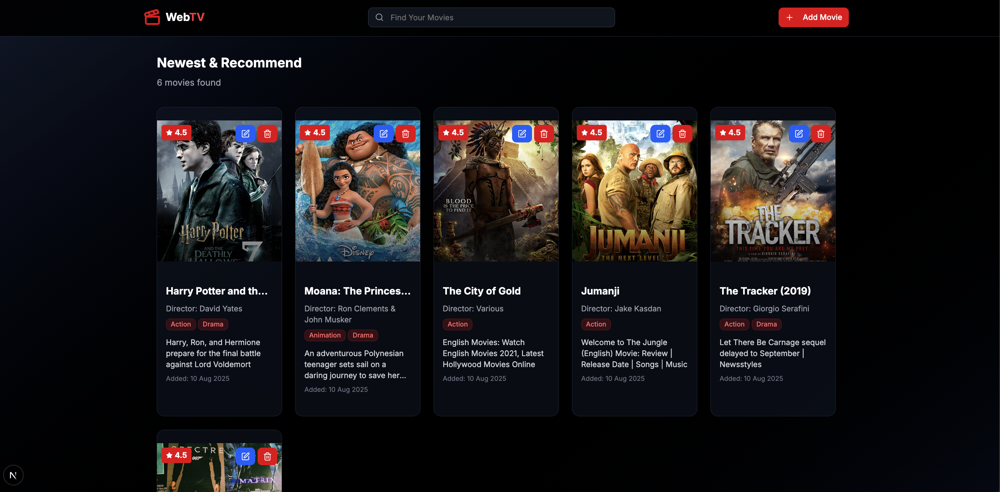
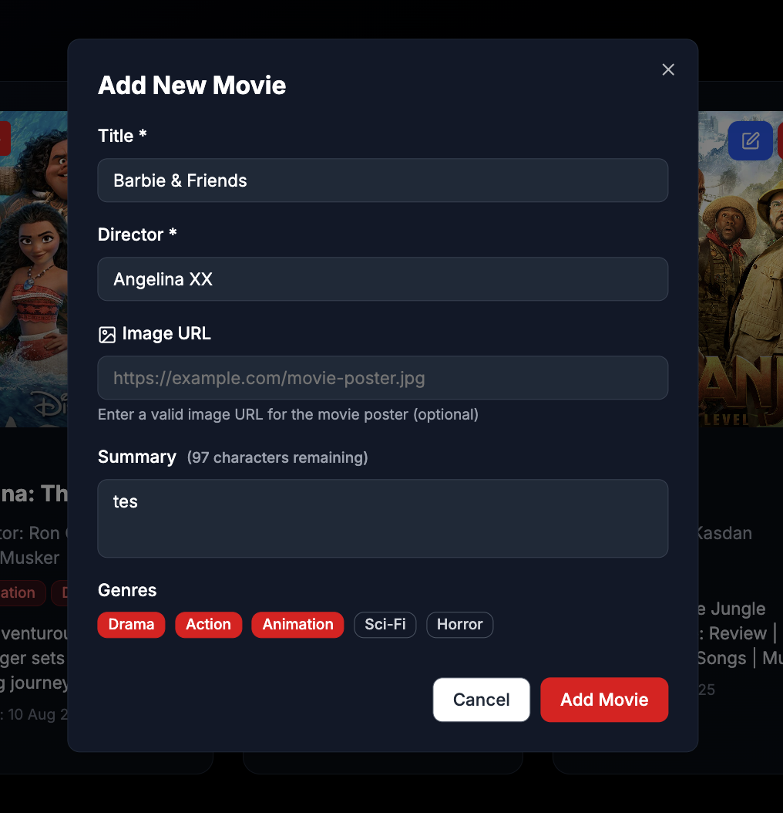
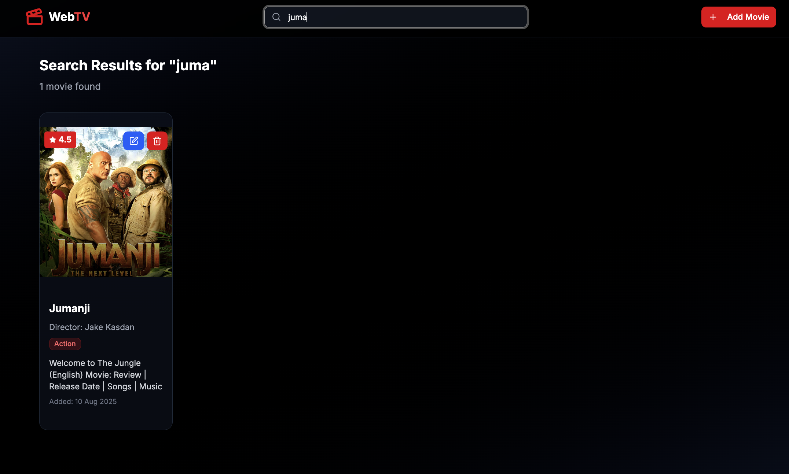
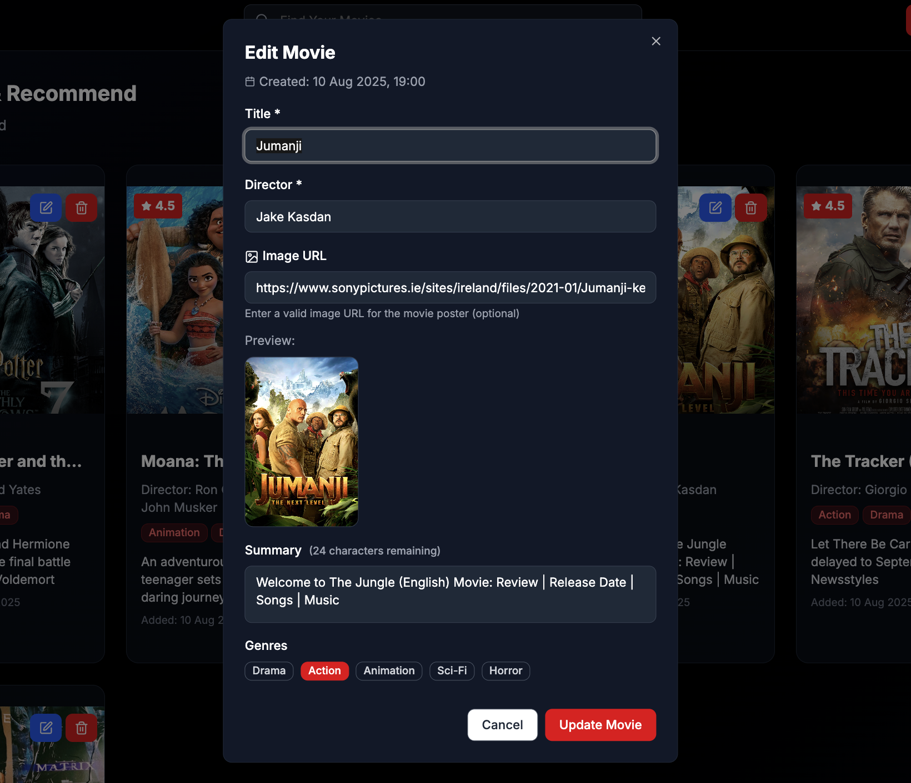
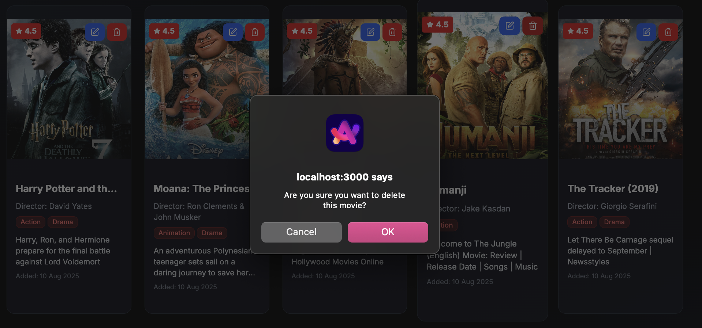
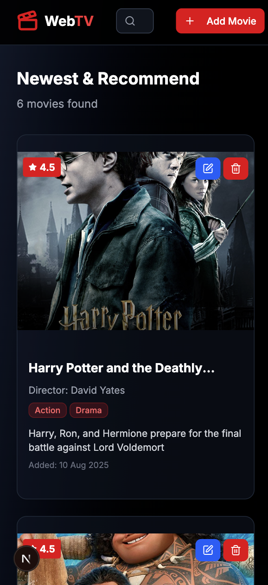
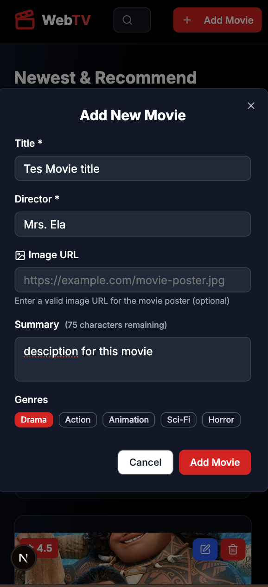
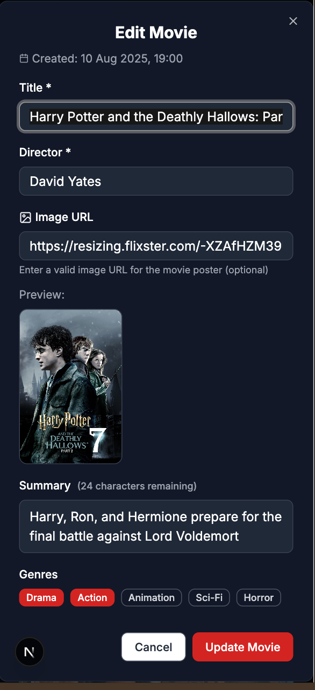

<p align="center">
   <h2 align="center">WebTV Movies CRUD</h2>
</p>

<p align="center">
    <a href="https://github.com/laidalavenia/Movies-CRUD/issues"></a>
    <a href="https://github.com/laidalavenia/Movies-CRUD"></a>
    <a href="https://github.com/laidalavenia/Movies-CRUD/pulls"></a>
</p>

## WebTV Movies CRUD

WebTV is a modern web application for managing your movie collection. This application provides a clean and intuitive interface to view, add, edit, and delete movies from your personal database. Built with modern React technologies, it offers a seamless user experience for movie enthusiasts who want to organize their favorite films.

## Deployment Website

*[https://movies-webtv.vercel.app/]*

## Features

- **Movie List Display**: Browse through your entire movie collection in an organized grid layout
- **Add New Movies**: Easy-to-use form for adding new movies to your collection
- **Search Functionality**: Quick search movies by title to find specific films
- **Edit Movies**: Update movie information with inline editing capabilities
- **Delete Movies**: Remove movies from your collection with confirmation dialogs
- **Responsive Design**: Fully responsive interface that works on all devices

## Tech Stack

This website was developed using modern tech stack:

- **React** - JavaScript library for building user interfaces
- **Next.js** - React framework for production-ready applications
- **shadcn/ui** - Modern UI component library 
- **Tailwind CSS** - Utility-first CSS framework for styling
- **TypeScript** - Type-safe JavaScript development

## Project Structure

```
MOVIES-CRUD/
├── .next/                          # Next.js build output
├── node_modules/                   # Project dependencies
├── public/                         # Static files
├── src/
│   ├── app/
│   │   ├── favicon.ico            # App favicon
│   │   ├── globals.css            # Global CSS styles
│   │   ├── layout.tsx             # Root layout component
│   │   └── page.tsx               # Main page component
│   ├── assets/images/readme/      # Documentation images
│   ├── components/
│   │   ├── ui/                    # shadcn/ui components
│   │   │   ├── badge.tsx          
│   │   │   ├── button.tsx         
│   │   │   ├── card.tsx           
│   │   │   ├── dialog.tsx        
│   │   │   ├── input.tsx          
│   │   │   ├── select.tsx         
│   │   │   └── textarea.tsx       
│   │   ├── MovieCard.tsx          
│   │   └── Navbar.tsx             
│   ├── lib/
│   │   └── utils.ts               # Utility functions
│   ├── pages/movies/components/
│   │   └── MovieForm.tsx          # Movie form component
│   ├── types/
│   │   └── movie.ts               # TypeScript type definitions
│   └── utils/
│       ├── dateUtils.ts           # Date formatting utilities
│       └── localStorage.ts        # Local storage helper functions
├── .gitignore                      # Git ignore rules
├── components.json                 # shadcn/ui configuration
├── eslint.config.mjs              # ESLint configuration
├── next-env.d.ts                  # Next.js TypeScript declarations
├── next.config.ts                 # Next.js configuration
├── package-lock.json              # Package lock file
├── package.json                   # Project dependencies and scripts
├── postcss.config.mjs             # PostCSS configuration
├── README.md                      # Project documentation
└── tsconfig.json                  # TypeScript configuration
```

### Key Directories Explanation

- **`src/app/`** - Contains the main Next.js app router files including global styles and layout
- **`src/components/ui/`** - Reusable UI components from shadcn/ui library
- **`src/components/`** - Custom application components like MovieCard and Navbar
- **`src/lib/`** - Utility functions and helper libraries
- **`src/types/`** - TypeScript type definitions for type safety
- **`src/utils/`** - Application-specific utility functions for data handling
- **`src/assets/`** - Static assets including images and documentation files

## Run Locally

Clone the project

```bash
git clone https://github.com/laidalavenia/Movies-CRUD.git
```

Go to the project directory

```bash
cd Movies-CRUD
```

Install dependencies

```bash
npm install
```

Start the development server

```bash
npm run dev
```

Build for production

```bash
npm run build
```

Start production server

```bash
npm start
```

## Website Views

<h2 align="center">1. Movies List Page</h2>

<p align="center">
    
</p>

<h2 align="center">2. Add Movie Form</h2>

<p align="center">
    
</p>

<h2 align="center">3. Search Functionality</h2>

<p align="center">
    
</p>

<h2 align="center">4. Edit Movie</h2>

<p align="center">
    
</p>

<h2 align="center">5. Delete Confirmation</h2>

<p align="center">
    
</p>

<h2 align="center">6. Responsive Mobile View</h2>

<p align="center">
    
</p>

<p align="center">
    
</p>

<p align="center">
    
</p>

## Contributing

1. Fork the project
2. Create your feature branch (`git checkout -b feature/AmazingFeature`)
3. Commit your changes (`git commit -m 'Add some AmazingFeature'`)
4. Push to the branch (`git push origin feature/AmazingFeature`)
5. Open a Pull Request

## License

This project is open source and available under the [MIT License](LICENSE).